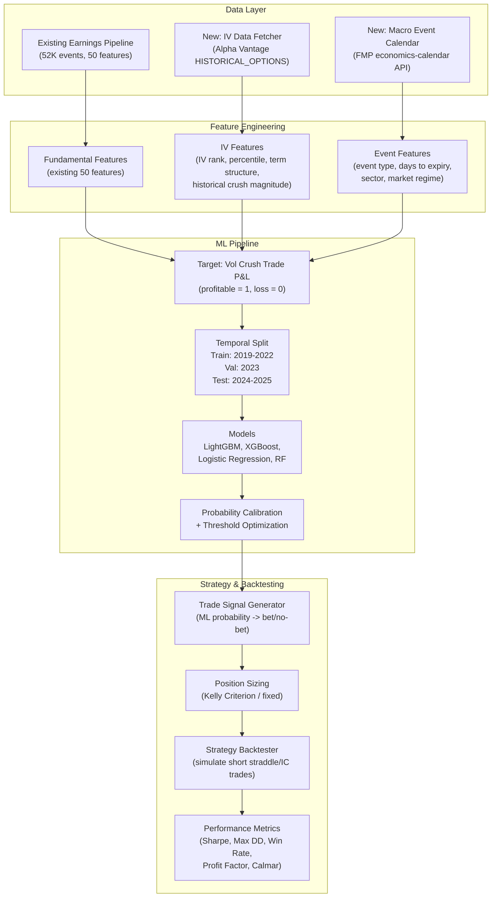
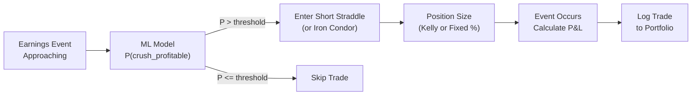

# ML-Powered Option Volatility Crush Strategy

## Overview

Build an ML-powered option volatility crush strategy that predicts which pre-earnings (and macro event) short-volatility trades will be profitable, combining the existing earnings pipeline data with new implied volatility features, proper temporal evaluation, and full strategy backtesting with trade metrics.

## Todos

- [ ] **Data Pipeline** — Build IV data pipeline: fetch historical option chains via Alpha Vantage HISTORICAL_OPTIONS API (pre/post event dates), fetch macro events via FMP economics-calendar, compute IV from option prices using BS inversion, merge with existing earnings dataset
- [ ] **Feature Engineering** — Engineer ~15-20 new volatility features from real options data (ATM IV, IV rank/percentile, straddle price pct, IV term structure slope, historical crush magnitude, vol-of-vol) and merge with existing 50 earnings features
- [ ] **Target Labeling** — Define and compute binary target variable (crush_profitable) based on actual move vs. expected move, with configurable thresholds
- [ ] **ML Pipeline** — Build ML training pipeline with temporal split, LightGBM/XGBoost/LR/RF models, probability calibration, threshold optimization using MCC
- [ ] **Backtester** — Implement strategy backtester: simulate short straddle trades filtered by ML signal, compute per-trade P&L, track portfolio equity curve
- [ ] **Metrics & Benchmarks** — Calculate strategy metrics (Sharpe, max DD, Calmar, win rate, profit factor) and compare ML strategy vs. naive always-trade and rule-based baselines
- [ ] **Visualization** — Create presentation-ready plots: equity curves, drawdown chart, confusion matrix, calibration plot, SHAP feature importance, returns heatmap
- [ ] **Notebook Assembly** — Assemble final vol_crush_strategy.ipynb notebook that ties together all modules with clear narrative flow for class presentation

---

## Context: What Already Exists

The project already has a robust **earnings beat prediction pipeline**:

- `earnings_pipeline.py` fetches fundamental data from Alpha Vantage, FMP, Yahoo Finance
- `data/ml_ready/` contains **52K+ rows** across S&P 500 and Russell 2000 with **50 features** (analyst estimates, revision momentum, profit margins, price changes)
- `modeling.ipynb` has a full ML pipeline with temporal splits, calibration, threshold optimization
- `option_volatility_crush.ipynb/` has the conceptual strategy notebook (Black-Scholes, IV crush explanation)

**The gap:** No implied volatility / options data, no vol crush trade simulation, no strategy P&L evaluation.

---

## Architecture Overview



---

## Phase 1: Data Collection & IV Pipeline

### 1A. Historical Options Data via Alpha Vantage `HISTORICAL_OPTIONS`

Alpha Vantage provides historical option chain data for any US equity on any date going back to **2017**. This is the primary data source for real implied volatility.

**API endpoint:**

```
GET https://www.alphavantage.co/query?function=HISTORICAL_OPTIONS&symbol=NVDA&date=2024-01-25&apikey=YOUR_KEY
```

**Fetching strategy:** For each earnings event in the existing dataset (~11K S&P 500 events):

- Fetch option chain **2 trading days before** the announcement date (pre-event)
- Fetch option chain **1 trading day after** the announcement date (post-event)
- Extract ATM calls + puts (nearest strike to stock price)
- Compute IV from option prices using Black-Scholes inversion (Newton's method)

**Key fields to compute per event:**

- `iv_pre_event`: ATM implied volatility 2 days before event
- `iv_post_event`: ATM implied volatility 1 day after event
- `iv_crush_pct`: (iv_pre - iv_post) / iv_pre
- `straddle_price_pct`: ATM straddle price as % of stock price (= expected move proxy)
- `atm_call_price`, `atm_put_price`: raw ATM option prices
- `option_volume_pre`, `open_interest_pre`: liquidity indicators
- `actual_move_pct`: realized overnight move (from existing price data)

**IV computation from prices (Black-Scholes inversion):**

```python
from scipy.optimize import brentq
from scipy.stats import norm
import numpy as np

def implied_vol(price, S, K, T, r, option_type='call'):
    def bs_price(sigma):
        d1 = (np.log(S/K) + (r + sigma**2/2)*T) / (sigma*np.sqrt(T))
        d2 = d1 - sigma*np.sqrt(T)
        if option_type == 'call':
            return S*norm.cdf(d1) - K*np.exp(-r*T)*norm.cdf(d2)
        return K*np.exp(-r*T)*norm.cdf(-d2) - S*norm.cdf(-d1)
    return brentq(lambda s: bs_price(s) - price, 0.01, 5.0)
```

**Rate limit consideration:** Alpha Vantage free tier = 25 calls/day. Premium tier needed for bulk fetching. We need ~22K API calls (11K events x 2 dates). With caching + batching, this is feasible over a few days on premium, or we can scope to S&P 500 only (~11K events x 2 = ~22K calls).

**Fallback (if API quota is tight):** Supplement with realized vol proxy features from existing price data for events where options data is unavailable.

### 1B. Macro Event Calendar via FMP `economics-calendar`

FMP provides a full economic calendar with event type, date, previous/estimate/actual values, and impact level.

**API endpoint:**

```
GET https://financialmodelingprep.com/stable/economics-calendar?apikey=YOUR_KEY&from=2017-01-01&to=2025-12-31
```

**Response fields:** date, country, event, currency, previous, estimate, actual, change, impact (Low/Medium/High)

**Usage:** For each earnings event, compute:

- `days_to_nearest_macro`: days between earnings date and nearest high-impact macro event
- `macro_event_same_week`: binary flag if CPI/FOMC/NFP falls in the same week
- `macro_surprise_recent`: most recent macro surprise (actual - estimate) as a market regime signal

---

## Phase 2: Feature Engineering

### New Options-Based Features (from Alpha Vantage HISTORICAL_OPTIONS)

**Primary IV features (computed from real option chain data):**

- `iv_pre_event`: ATM implied vol 2 days before event
- `iv_rank_30d`: where current IV sits relative to last 30 days (requires multiple lookback fetches or realized vol proxy)
- `iv_percentile_252d`: percentile rank of IV over past year
- `straddle_price_pct`: ATM straddle / stock price (market's expected move)
- `iv_term_structure_slope`: near-expiry IV vs. far-expiry IV (steep = high event premium)
- `put_call_volume_ratio`: put volume / call volume from option chain
- `atm_open_interest`: open interest at ATM strike (liquidity proxy)

**Realized vol features (from existing price data, always available):**

- `realized_vol_5d`: rolling 5-day std of log returns (pre-event realized vol)
- `realized_vol_21d`: rolling 21-day std of log returns (background vol level)
- `vol_expansion_ratio`: realized_vol_5d / realized_vol_21d (pre-event vol ramp-up)
- `iv_rv_spread`: iv_pre_event - realized_vol_21d (implied vs realized gap = "vol risk premium")
- `historical_move_avg`: mean abs(earnings day return) over past 8 quarters
- `historical_move_std`: std of past earnings moves (consistency)
- `vol_of_vol`: rolling std of realized_vol_21d (regime indicator)

**Macro / context features:**

- `days_to_nearest_macro`: from FMP economic calendar
- `macro_event_same_week`: binary flag
- `sector_avg_crush`: mean IV crush for this sector historically

### Combined Feature Set

Merge existing 50 earnings features + ~20 new volatility/options features = **~70 total features**.

### Target Variable Definition

**Binary target: `crush_profitable`** -- was selling the ATM straddle profitable?

```python
# From actual option chain data:
# premium_collected = straddle_price (ATM call + ATM put)
# intrinsic_at_expiry = abs(stock_price_after - strike)
# Trade profit if premium_collected > intrinsic_at_expiry

# Simplified (short-term, next-day exit):
expected_move_pct = straddle_price_pct  # market-implied expected move
actual_move_pct = abs(post_event_return)
crush_profitable = (actual_move_pct < expected_move_pct).astype(int)
```

Also compute **continuous target** for regression: `crush_pnl_pct = straddle_price_pct - actual_move_pct` (positive = profit).

---

## Phase 3: ML Pipeline

### Temporal Split (extends existing approach in `modeling.ipynb`)

```
Train:      2019-2022   (need 2017-2018 for lookback features)
Validation: 2023
Test:       2024-2025
```

### Models to Train

1. **Logistic Regression** (baseline, interpretable)
2. **LightGBM** (primary model, handles mixed feature types well)
3. **XGBoost** (comparison)
4. **Random Forest** (for feature importance via MDA)

### Evaluation Metrics (per ML SKILL reference)

Since the target may be moderately imbalanced:

- **Primary:** MCC (Matthews Correlation Coefficient)
- **AUC-PR** (better than AUC-ROC for imbalanced)
- **Brier Score** (calibration quality)
- **Log Loss**
- Precision/Recall at chosen threshold

### Calibration

Calibrate probabilities using isotonic regression on the validation set (same approach as existing `modeling.ipynb`).

---

## Phase 4: Strategy Backtesting

### Trade Simulation Logic



### Trade P&L Computation

For each event where ML says "trade":

```python
# Short straddle P&L (simplified)
entry_cost = straddle_price  # premium collected
exit_cost = max(actual_move - strike_distance, 0)  # intrinsic value at expiry
pnl = entry_cost - exit_cost  # positive = profit

# Or for Iron Condor (capped risk):
max_loss = wing_width - premium_collected
pnl = premium_collected if abs(move) < short_strike_distance else -max_loss
```

### Performance Metrics to Report

- **Sharpe Ratio** (annualized)
- **Max Drawdown** (% and duration)
- **Calmar Ratio** (return / max DD)
- **Win Rate** (% of profitable trades)
- **Profit Factor** (gross profit / gross loss)
- **Average P&L per trade**
- **Number of trades** (shows selectivity)
- **Comparison vs. naive strategy** (always sell vol on every earnings)

### Benchmark Comparison

Compare ML-filtered strategy against:

1. **Always trade** (sell vol on every earnings event)
2. **Random selection** (randomly pick 50% of events)
3. **Simple rule-based** (e.g., only trade when IV rank > 80%)

---

## Phase 5: Visualization & Presentation

- Equity curve comparison (ML vs. naive vs. benchmarks)
- Cumulative P&L with drawdown overlay
- Confusion matrix on test set
- Calibration plot
- Feature importance (SHAP summary plot)
- Monthly/quarterly returns heatmap
- Trade distribution (P&L histogram)

---

## File Structure

```
poly_earnings/
├── vol_crush_strategy/
│   ├── data_pipeline.py         # IV data fetcher + macro events
│   ├── feature_engineering.py   # New vol features + merge with existing
│   ├── target_labeling.py       # Crush trade P&L target computation
│   ├── ml_pipeline.py           # Train/val/test + models + calibration
│   ├── backtester.py            # Strategy simulation engine
│   └── metrics.py               # Sharpe, DD, profit factor, etc.
├── vol_crush_strategy.ipynb     # Main notebook (imports above modules)
├── data/
│   ├── raw/                     # (existing)
│   ├── ml_ready/                # (existing)
│   └── vol_crush/               # New: IV features + trade outcomes
│       ├── iv_features.csv
│       ├── macro_events.csv
│       └── crush_dataset.csv    # Final merged dataset
```

---

## Key Design Decisions

- **Real IV Data:** Use Alpha Vantage `HISTORICAL_OPTIONS` to get actual option chain data per event. Supplement with realized vol proxies where API data is missing.
- **IV Computation:** Compute IV from option prices via Black-Scholes inversion (Newton/Brent) -- good demonstration of quantitative finance concepts for the class.
- **Macro Events:** Use FMP `economics-calendar` API for CPI/FOMC/NFP proximity features.
- **Option Strategy:** Use simplified **short straddle** for P&L calculation. Optionally add iron condor as a more realistic alternative.
- **Position Sizing:** Start with fixed-size positions; add Kelly criterion as an enhancement.
- **Data Leakage Prevention:** All volatility features use only data available before the event. No post-event information leaks into features. Scaler/encoder fitted inside pipeline per ML SKILL reference.
- **API Rate Limits:** Alpha Vantage premium tier needed for bulk historical options fetches. Cache aggressively. Scope to S&P 500 (~11K events) to keep API calls manageable.
